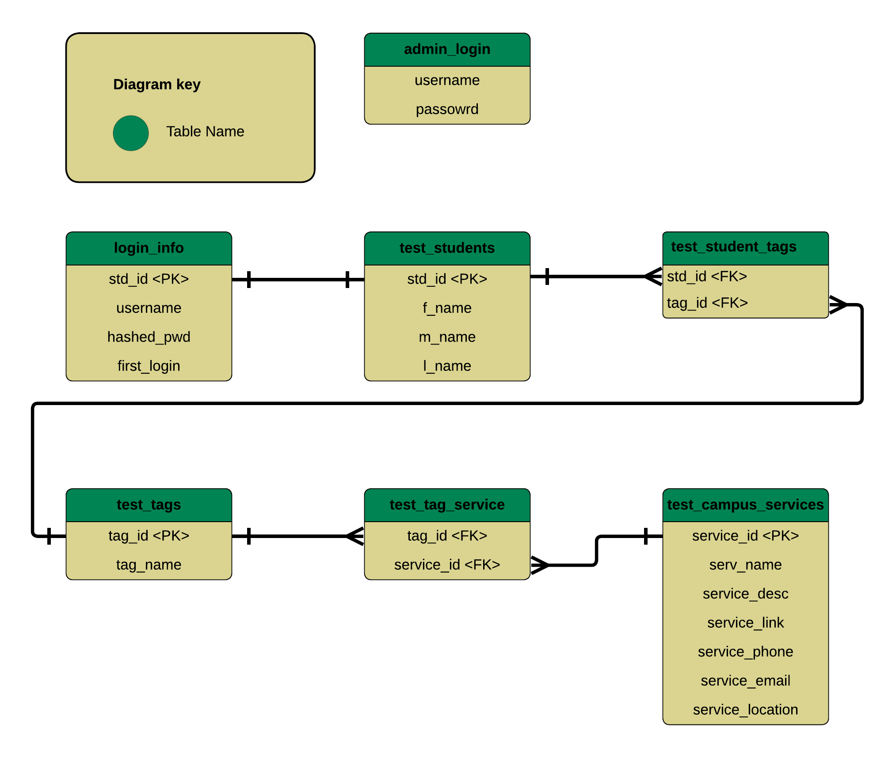
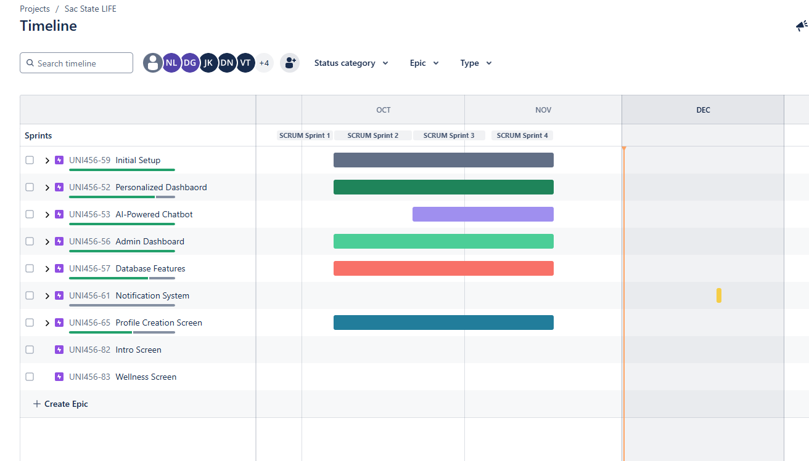

# SAC-LIFE Mobile Application 
  

  ## Table of Contents

- [Synopsis](#Synopsis)
- [Testing](#Testing)
- [Deployment](#Deployment)
- [ERD](#ERD)
- [RoadMap](#Roadmap)
  


## Created by The Nest  
 #### Nicholas Lewis   
 #### Christian Buco   
 #### Randy Pham   
 #### Justin Rivera   
 #### Bryce Chao  
 #### Devin Grace  
 #### Vinny Thai  
 #### Darryl Nguyen  
 #### Aaron Jumawan  

##  Synopsis  

### Our team focused on building a secure, personalized, and user-friendly platform with the following core accomplishments:

- **Robust Backend Infrastructure:** Students authenticate securely using JWT tokens, with encrypted passwords stored in an Azure SQL database for enhanced security.
- **Smart Profile Personalization:** Each user completes a brief onboarding questionnaire to generate unique service tags. These tags drive personalized service recommendations across the app.
- **Modernized User Interface:** The mobile app UI has been redesigned using React Native and Expo to deliver a clean, accessible, and responsive user experience.
- **Interactive Dashboard:** The student dashboard features an integrated calendar to track both personal and campus events, improving organization and time management.
- **AI Chatbot Integration:** HerkyBot, powered by the OpenAI API, provides intelligent, real-time responses to student questions about resources, deadlines, and campus navigation.

Behind the scenes, Sac LIFE uses a normalized Azure SQL database to store and manage student profiles, chatbot logs, service data, and tag relationships. The system includes a tag-based query engine that surfaces relevant services based on each student’s unique attributes.

Administrative functionality is enabled via a secure React-based dashboard. Admin users can view student data, manage chatbot logs, and oversee campus services. Role-based access control is in place, with three permission levels: Super Admin (full access), Admin (general management), and Support (read-only).


## Testing 
We employed a combination of manual testing, unit tests, and integration tests to ensure the functionality and reliability of the SAC-LIFE Mobile Application.

  1. Manual Testing
     - Performed across both the mobile app and admin website to identify usability and layout issues.
     - Verified key features such as:
         > User login and profile creation.
         > Dashboard navigation and AI chatbot responses.
         > Admin panel functionality for managing users and tags.
  
  2. Unit Testing 
     - Focused on testing each feautre of the app and admin website
     - Tested each screen of the Sac LIFE App 
     - Tools: Jest for JavaScript-based testing.
    
  3. Integration Testing
     - Verified interaction between the mobile app, backend API, and Azure SQL database.
     - Tools: Postman for API testing and Expo for mobile debugging.
    
  4. Automated Testing (In Progress)
     - Leveraging frameworks like Selenium for end-to-end testing.
  

  ### How to Run Tests  
  ---
  > **Mobile App Testing**
  ```cmd
  cd SacStateLIFE
  npx jest
  ```
   > **Admin Website Testing**
  ```cmd
  cd admin-web
  npx jest
  ```
 > **Specfic File Testing**
  ```cmd
  npx jest path/to/your/testFile.test.js
  ```
  

## Deployment
  The SAC-LIFE Mobile Application consists of four main components: the mobile app, the admin website, and the backend API. Each component is deployed separately to ensure scalability and modularity.
  
  1. **Mobile App**  
     - The app was deployed using Expo during development and testing.  
     - For production, an Android App Bundle (AAB) was built using Expo's build tools.
     - iOS deployment was deferred due to time constraints.
     - The final plan is to distribute the app via the Google Play Store and, eventually, the Apple App Store. 
  
  2. **Admin Website**  
     - Developed using React and deployed via Azure Static Web Apps.
     - Connected to the backend API hosted on Azure App Service.
     - Deployed on Azure with HTTPS enabled for secure connections.  
  
  3. **Backend API**  
     - Hosted on Microsoft Azure as a Node.js application.  
     - Connected to an Azure SQL database for reliable and scalable data storage.  
     - Secured with environment variables for sensitive configuration (e.g., database credentials and JWT secrets).
     - HTTPS enabled for secure connections.
  
  ### Deployment Steps  
  ---
  #### Clone the Repository  
  1. Clone the project repository to your local machine:  
     ```bash
     git clone https://github.com/Sac-State-Mobile-App-The-Nest/SAC-LIFE.git
  
  2. Navigate to the project directory:  
     ```bash
     cd SAC-LIFE
  ---

  #### Mobile App 
  1. Navigate to the mobile-app folder:  
     ```bash
     cd SacStateApp

  2. Create a .env file with the following configuration:  
     ```env
     DEV_BACKEND_SERVER_IP=<your-IP-address>
     # Replace the IP address with your own
     # Make sure to also rename the env file from 'env' to '.env'
  
  3. Install dependencies:  
     ```bash
     npm install

  4. Start the development server:
     ```bash
     npm start

  5. For production, build the app binaries:
     ```bash
     expo build:android
     expo build:ios

  6. Upload the generated binaries to the respective app stores.

  ---
  #### Admin Website
  1. Navigate to the admin-web folder:  
     ```bash
     cd ../admin-web
  
  2. Install dependencies:  
     ```bash
     npm install

  3. Start the development server:
     ```bash
     npm start

  4. For now, access admin website locally

  ---
  #### Backend API
  1. Navigate to the backend-api fodler:  
     ```bash
     cd ../backend-api
  
  2. Create a .env file with the following configuration:  
     ```env
     DB_USER=<your-database-user>
     DB_PASSWORD=<your-database-password>
     DB_SERVER=<your-database-server>
     DB_DATABASE=<your-database-name>
     JWT_SECRET_TOKEN=<your-secret-token>
     JWT_REFRESH_TOKEN=<your-refresh-token>
     WT_SECRET_ADMIN=<your-adim-secret-token>
     # Make sure to also rename the env file from 'env' to '.env'

  3. Install dependencies:
     ```bash
     npm install

  4. Start the backend API server:
     ```bash
     npm start

  5. Verify API endpoints using Postman or a similar tool

  ---
  ### Chatbot API
  1. Navigate to the backend-api fodler:  
       ```bash
       cd ../chatbot-api

  2. Start the chatbot server using Google Dialog Flow  
       ```bash
      npm install @google-cloud/dialogflow
      npm start
  3. Test on the app UI
    

## Developer Instructions
Placeholder for now

## App Layout and Flow
  


## ERD
  

## Roadmap
### Key Milestones  

| Milestone                  | Start Date  | End Date    | Status       |
|----------------------------|-------------|-------------|--------------|
| Initial setup              | 2024-10-07  | 2024-11-17  | Completed    |
| Personalized Dashbaord     | 2024-10-07  |             | In Progress  |
| AI Powered Chatbot         | 2024-10-22  |             | In Progress  |
| Admin Dashbaord            | 2024-10-07  |             | In Progress  |
| Database Features          | 2024-10-07  |             | In Progress  |
| Profle Creation Screen     | 2024-10-07  |             | In Progress  |
| Notification System        |             |             | Not Started  |
| Wellness Screen            |             |             | Not Started  |
| Intro Screen               |             |             | Not Started  |

### Visual Timeline
  


      
  

