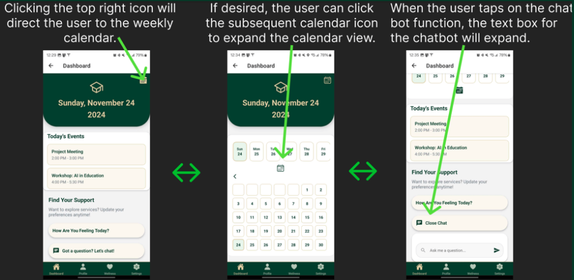
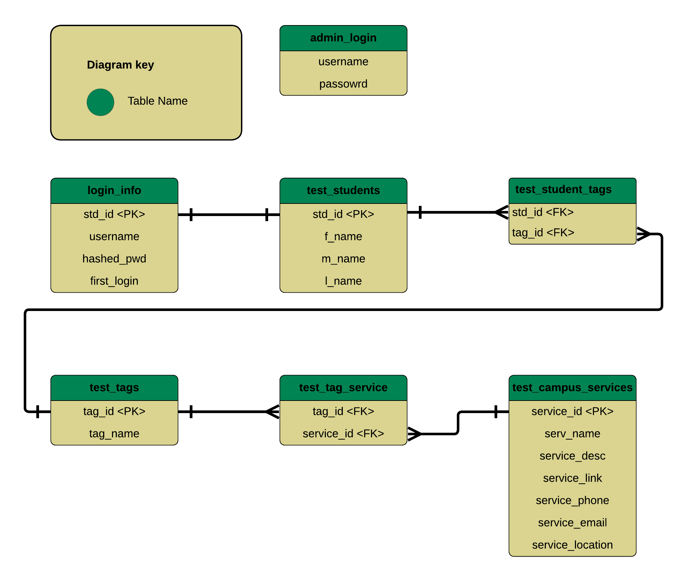

# SAC-LIFE Mobile Application 
  

  ## Table of Contents

- [Synopsis](#Synopsis)
- [Testing](#Testing)
- [Deployment](#Deployment)
- [ERD](#ERD)
  


## Created by The Nest  
 #### Nicholas Lewis   
 #### Christian Buco   
 #### Randy Pham   
 #### Justin Rivera   
 #### Bryce Chao  
 #### Devin Grace  
 #### Vinny Thai  
 #### Darryl Nguyen  
 #### Aaron Jumawan  

##  Synopsis  

### Our team focused on building a secure, personalized, and user-friendly platform with the following core accomplishments:

- **Robust Backend Infrastructure:** Students authenticate securely using JWT tokens, with encrypted passwords stored in an Azure SQL database for enhanced security.
- **Smart Profile Personalization:** Each user completes a brief onboarding questionnaire to generate unique service tags. These tags drive personalized service recommendations across the app.
- **Modernized User Interface:** The mobile app UI has been redesigned using React Native and Expo to deliver a clean, accessible, and responsive user experience.
- **Interactive Dashboard:** The student dashboard features an integrated calendar to track both personal and campus events, improving organization and time management.
- **AI Chatbot Integration:** HerkyBot, powered by the OpenAI API, provides intelligent, real-time responses to student questions about resources, deadlines, and campus navigation.

Behind the scenes, Sac LIFE uses a normalized Azure SQL database to store and manage student profiles, chatbot logs, service data, and tag relationships. The system includes a tag-based query engine that surfaces relevant services based on each student’s unique attributes.

Administrative functionality is enabled via a secure React-based dashboard. Admin users can view student data, manage chatbot logs, and oversee campus services. Role-based access control is in place, with three permission levels: Super Admin (full access), Admin (general management), and Support (read-only).

The Sac State LIFE app is an initiative led by Dr. Basia D. Ellis, Ph.D., an Associate Professor of Child and Adolescent Development at Sacramento State University. As the Product Owner, Dr. Ellis is dedicated to enhancing digital infrastructure to improve student engagement and access to support services. The project leverages research insights and interdisciplinary collaboration to create a comprehensive mobile application that empowers students, fosters campus connection, and supports academic success. With a focus on addressing key student needs, this app aims to transform the way students interact with campus resources and services.


## Testing 
We employed a combination of manual testing, unit tests, and integration tests to ensure the functionality and reliability of the SAC-LIFE Mobile Application.

  1. Manual Testing
     - Performed across both the mobile app and admin website to identify usability and layout issues.
     - Verified key features such as:
         > User login and profile creation.
         > Dashboard navigation and AI chatbot responses.
         > Admin panel functionality for managing users and tags.
  
  2. Unit Testing 
     - Focused on testing each feautre of the app and admin website
     - Tested each screen of the Sac LIFE App 
     - Tools: Jest for JavaScript-based testing.
    
  3. Integration Testing
     - Verified interaction between the mobile app, backend API, and Azure SQL database.
     - Tools: Postman for API testing and Expo for mobile debugging.
    
  4. Automated Testing (In Progress)
     - Leveraging frameworks like Selenium for end-to-end testing.
  

  ### How to Run Tests  
  ---
  > **Mobile App Testing**
  ```cmd
  cd SacStateLIFE
  npx jest
  ```
   > **Admin Website Testing**
  ```cmd
  cd admin-web
  npx jest
  ```
 > **Specfic File Testing**
  ```cmd
  npx jest path/to/your/testFile.test.js
  ```
  

## Deployment
  The **SAC-LIFE Mobile Application** consists of five main components:  
- Mobile App  
- Admin Website  
- Firebase Notifications  
- SendGrid Email Integration  
- Backend API
  
Each component is deployed independently to support scalability, modular development, and easier maintenance.

  
  ### 1. **Mobile App**
- Built with **React Native** using **Expo**.
- During development and testing, the app was deployed using Expo Dev Client.
- For production, an **Android App Bundle (AAB)** was built using Expo’s build tools.
- iOS deployment was postponed due to time constraints.
- Final distribution will be handled via the **Google Play Store**, with future plans for the **Apple App Store**.

  
 ### 2. **Admin Website**
- Built using **React** and deployed via **Azure Static Web Apps**.
- Secured with **HTTPS** by default.
- Integrated with the backend API hosted on Azure App Service.
  
  ### 3. **Backend API**
- Built with **Node.js/Express** and hosted on **Azure App Service**.
- Uses **Azure SQL Database** for structured and scalable data storage.
- Environment variables are used to secure sensitive credentials (e.g., database access, JWT secrets).
- API is accessible over **HTTPS**.

  ### 4. **Firebase Notifications**
- Integrated using **Firebase Cloud Messaging (FCM)**.
- Supports personalized and event-triggered push notifications to users.
- Tokens are stored in the database per user device to ensure delivery.

  ### 5. **SendGrid Email Service**
- Used to send confirmation email.
- Integrated into the backend via SendGrid’s API.
- Secured using API keys stored in environment variables.
  
  ### Deployment Steps  
  ---
  #### Clone the Repository  
  1. Clone the project repository to your local machine:  
     ```bash
     git clone https://github.com/Sac-State-Mobile-App-The-Nest/SAC-LIFE.git
     cd SAC-LIFE

  #### Mobile App
  
    ```bash
    cd SacStateLIFe
    ```
     
  1. Create a `.env` file (for local testing):
    ```env
    DEV_BACKEND_SERVER_IP=<your-backend-URL>
    ```
  
  2. Install dependencies:  
     ```bash
     npm install

  3. Start development (if needed):
    ```bash
    npx expo start --dev-client
    ```

  4. Build production binaries:
    ```bash
    eas build -p android --profile production
    ```

  5. Production version is uploaded to the **Google Play Console**.

  ---
  #### Admin Website
  
     ```bash
     cd ../admin-web
     ```
  
  1. Install dependencies:  
     ```bash
     npm install

  2. Start locally (for development only):
    ```bash
    npm start
    ```

  3. Production deployment is live via **Azure Static Web Apps** via manual deployment with build folder into satic web app.

  ---
  #### Backend API
  
     ```bash
     cd ../backend-api
     ```
     
  2. Environment variables are managed securely in **Azure App Service**. 
     ```env
     DB_USER=<your-database-user>
     DB_PASSWORD=<your-database-password>
     DB_SERVER=<your-database-server>
     DB_DATABASE=<your-database-name>
     JWT_SECRET_TOKEN=<your-secret-token>
     JWT_REFRESH_TOKEN=<your-refresh-token>
     JWT_SECRET_ADMIN=<your-adim-secret-token>
     PORT=<your-port-for-local-testing
     SENDGRID_API_KEY=<your-sengrid-api-key>
     OPENAI_API_KEY=<your-apoenAI-api-key
     # Make sure to also rename the env file from 'env' to '.env'

  2. To run locally (for development only):
    ```bash
    npm install
    npm start
    ```

3. The production API is deployed on **Azure** and secured with HTTPS.
    

## Developer Instructions
Placeholder for now

## App Layout and Flow
  




## ERD
  


      
  

