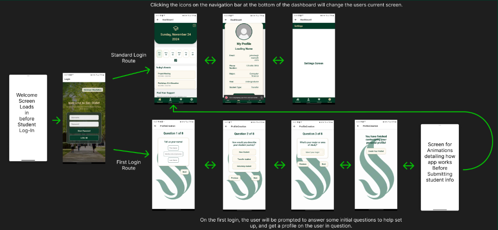
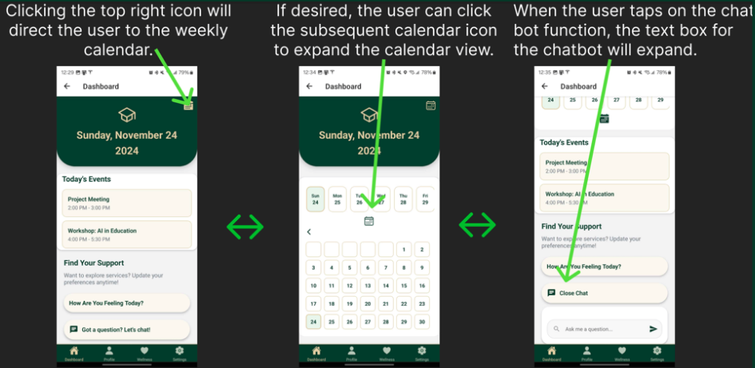

# SAC-LIFE Mobile Application 
  

  ## Table of Contents

- [Synopsis](#Synopsis)
- [Testing](#Testing)
- [Deployment](#Deployment)

## Created by The Nest  
 #### Nicholas Lewis   
 #### Christian Buco   
 #### Randy Pham   
 #### Justin Rivera   
 #### Bryce Chao  
 #### Devin Grace  
 #### Vinny Thai  
 #### Darryl Nguyen  
 #### Aaron Jumawan  

## Synopsis  

### Our work has focused on creating a secure, personalized, and user-friendly application with the following accomplishments:
  - ***Fully Functional Backend:*** Students can now log in securely using JWT authentication, with hashed passwords stored in an Azure SQL database.
  - **Personalized Profiles:** Each student’s profile is tailored with unique tags based on their responses, enabling customized campus service recommendations.
  - **Enhanced UI:** We've revamped the app’s user interface for better usability and a modern, polished look.
  - **Personal Dashboard Updates:** The dashboard now includes a calendar feature that displays precise dates, helping students stay organized.
  - **AI Chatbot Integration:** We’re leveraging Google Dialogflow to provide a responsive chatbot for improved student support.

  On the backend, we’ve implemented a relational database using Azure SQL to manage student data, campus services, and informational tags. Admins can now add or remove users through the admin website, and we've designed a query system to recommend campus services to students based on their tags, creating a personalized experience. The database schema is optimized for scalability and efficiency, ensuring robust data management as the app grows.  
  
For authentication, we’ve implemented a system that uses username and password logins, with plans to integrate SSO via Shibboleth/SAML to meet Sac State’s authentication standards. The admin website supports distinct roles: Super User (managing admin users), Admins (managing general users), and a Support role (view-only access). These features ensure secure and role-based access control, aligning with our project’s goals for both user and administrative functionality.  

## Testing  
Our testing information would go here  

## Deployment
Deployment info  

## Developer Instructions
Dev instructions here  

## App Layout and flow
  

      
  

